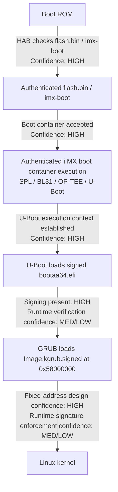

# Compulab i.MX8MP SOM: HAB Secure Boot with GRUB on top of U-Boot

## At 1-st

|IMPORTANT|
|---|

* 2-Image approach is removed in the latest branche [imx8-scarthgap-devel](https://github.com/compulab-yokneam/meta-compulab-hab/tree/imx8-scarthgap-devel).
* All concerns about using `Image.kgrub.signed` make no sense with using the updated meta-layer.

## Executive summary

This layer is best understood as a **Yocto signing and packaging layer** for an i.MX8M secure-boot design whose root of trust starts with **HAB authenticating the i.MX boot container (`flash.bin`)**.

It also prepares and installs:

- a **signed GRUB EFI binary** (`bootaa64.efi`)
- a **signed kernel for the GRUB path** (`Image.kgrub.signed`)
- a **fuse programming file** (`fuse.out`)

The layer therefore aims at the following boot chain:

```text
Boot ROM
  -> HAB authenticates flash.bin / imx-boot
    -> SPL / DDR init / BL31 / OP-TEE / U-Boot
      -> U-Boot loads GRUB (bootaa64.efi)
        -> GRUB loads Linux kernel from a fixed address
          -> Linux boots
```

The key conclusion from this second pass is:

1. **The ROM-to-U-Boot portion of the chain is clearly HAB-oriented and believable.**
2. **The GRUB and kernel portions are clearly signed and intentionally shaped for a secure flow.**
3. **This layer by itself does not fully prove who performs runtime verification of GRUB and the kernel after U-Boot starts.**

So this is absolutely a **secure-boot-capable architecture**, but the uploaded layer alone shows the **artifact preparation and installation** more clearly than it shows the **runtime enforcement mechanics** after `flash.bin` has been authenticated.

---

## What the layer is doing, in plain English

This layer does four big things:

### 1) It gathers the boot artifacts needed for HAB signing
From the Yocto build, it collects the pieces needed to sign the i.MX8 boot image and the OS boot artifacts.

### 2) It runs Compulab's CST-based signing flow
The `cst-tools` recipe invokes targets for:

- fuse generation
- kernel signing
- i.MX boot image signing
- UEFI/GRUB signing

### 3) It deploys signed outputs back into the image
It copies the signed artifacts into the deploy area and into the root filesystem.

### 4) It forces the installed system to use signed GRUB and a signed kernel
The postprocess hooks replace the normal EFI binary with a signed one and repoint `/boot/Image` at `Image.kgrub.signed`.

That means the runtime image is intentionally arranged to boot through the signed path.

---

## The most important files and what each one tells us

## `README.md`
The README says this layer exists to use Compulab's `cst-tools` inside Yocto, and the documented build results are:

* `flash.bin.signed`
* `Image.signed`
* `fuse.out`

It also points to the NXP HAB secure boot guide for fuse programming.

That tells us the layer's primary purpose is not general bootloader customization. Its purpose is specifically **HAB signing integration**.
|The exact quatation from the NXP Web Site|```NXP® Code Signing Tool for the High Assurance Boot library. Provides software code signing support designed for use with i.MX processors that integrate the HAB v4 and AHAB library in the internal boot ROM```
|:---|:---|


---

## `recipes-hab/cst/cst-tools.bb`
This is the center of the design.

It runs:

- `oe_runmake fuse`
- `oe_runmake -j 1 kernel`
- `oe_runmake imx-boot`
- `oe_runmake uefi`

That means the layer signs more than just the initial boot image. It also signs:

- the kernel
- the UEFI/GRUB binary

The deploy task copies out:

|NOTE|The ``meta-compulab-hab`` branch [imx8-scarthgap-devel](https://github.com/compulab-yokneam/meta-compulab-hab/blob/imx8-scarthgap-devel) deploys one kernel Image only|
|:---|:---|

* `Image.signed`
* ~~`Image.kgrub.signed`~~
* `flash.bin.signed`
* `fuse.out`
* `bootaa64.efi.signed`

Then this part is especially important:

```bitbake
mv ${DEPLOY_DIR_IMAGE}/Image.signed ${DEPLOY_DIR_IMAGE}/Image
mv ${DEPLOY_DIR_IMAGE}/bootaa64.efi.signed ${DEPLOY_DIR_IMAGE}/bootaa64.efi
```

That is a strong statement of intent: in the deploy area, the signed binaries become the default names.

It also installs these into the target image:

* `/boot/fuse.out`
* `/boot/hab_auth_img.cmd`
* `/boot/Image.signed`
* ~~`/boot/Image.kgrub.signed`~~
* `/boot/flash.bin.signed`
* `/boot/EFI/BOOT/bootaa64.efi.signed`

The presence of `hab_auth_img.cmd` is a major clue. It suggests the signing flow for at least one kernel path expects a **U-Boot HAB authentication command** to be usable at runtime.

---

## `conf/layer.conf`
This layer globally injects two postprocess hooks:

- `compulab_bootaa64_efi`
- `compulab_kernel_image`

That means this layer is not just producing signed files as optional outputs. It actively mutates the final root filesystem so that signed artifacts become the operational ones.

---

## `classes/compulab-hab.bbclass`
This file makes the runtime intent explicit.

### `compulab_bootaa64_efi()`
It does this:

- renames the normal `/boot/EFI/BOOT/bootaa64.efi` to `.unsigned`
- replaces it with `/boot/EFI/BOOT/bootaa64.efi.signed`

So the installed EFI loader is intended to be the **signed GRUB binary**.

### `compulab_kernel_image()`
It does this:

- removes `/boot/Image`
- recreates `/boot/Image` as a symlink to `Image.kgrub.signed`

So the default kernel seen by the boot chain becomes the **GRUB-oriented signed kernel**.

That is a very strong clue that this layer is not merely producing secure-boot artifacts for lab use. It expects them to be the artifacts used by the real system image.

---

## `recipes-bsp/imx-mkimage/imx-boot_%.bbappend`
This file is the strongest evidence for the HAB part of the chain.

It creates a HAB staging area and collects:

* `u-boot.bin`
* `u-boot.itb`
* `u-boot.its`
* `u-boot-nodtb.bin`
* `u-boot-spl.bin`
* `u-boot-spl-ddr.bin`
* `tee.bin`
* `bl31.bin`
* `flash.bin`
* `print_fit_hab.sh`

This is exactly the sort of artifact set you expect for signing the i.MX8M boot container.

It also runs:

* `flash_evk`
* `print_fit_hab`

The ``print_fit_hab`` step is especially telling. That is typically used to derive HAB-related offsets and information for signing/authentication around FIT-contained boot artifacts.

### What this means
This file is where the layer gathers the low-level boot pieces that the ROM/HAB flow actually cares about.

This is the part of the trust chain that is the least speculative:

```text
ROM -> HAB -> authenticated flash.bin
```

That part is clearly what the layer is designed around.

---

## `recipes-bsp/u-boot/compulab/imx8m/security.cfg`
This config fragment is extremely revealing.

It enables:

* `CONFIG_SECURE_BOOT=y`
* `CONFIG_IMX_HAB=y`
* `CONFIG_IMX_SPL_FIT_FDT_SIGNATURE=y`

It also sets several image layout and load-address related parameters.

### Why this matters
This says the U-Boot build itself is being configured with explicit **HAB / secure boot awareness**.

The most meaningful settings are:

#### `CONFIG_IMX_HAB=y`
This says U-Boot includes i.MX HAB support.

#### `CONFIG_SECURE_BOOT=y`
This is a broader signal that the U-Boot build is intended for secure boot operation.

#### `CONFIG_IMX_SPL_FIT_FDT_SIGNATURE=y`
This suggests signature handling related to SPL FIT / FDT processing.

Even without seeing all downstream U-Boot code, this file strongly supports the idea that the bootloader side of the design is intentionally HAB-enabled.

---

## `recipes-kernel/linux/linux-compulab.main`
This recipe simply copies the built kernel `Image` into the HAB staging area.

By itself, this is not remarkable.

What makes it meaningful is that `cst-tools.bb` later signs that kernel twice:

* `hab/signed/k/Image`
* ~~`hab/signed/kgrub/Image`~~

|NOTE|This 2-image approach was removed by [imx8-scarthgap-devel](https://github.com/compulab-yokneam/meta-compulab-hab/blob/imx8-scarthgap-devel)|
|:---|:---|
That split strongly suggests **two kernel signing/use cases**:

1. a more direct HAB/U-Boot path
2. a GRUB-specific path

The postprocess hook then chooses the second one for `/boot/Image`.

---

## `recipes-bsp/grub/grub-efi_%.bbappend`
This recipe copies GRUB's EFI binary into the HAB staging area as `bootaa64.efi`, and it applies two patches.

This is where the GRUB portion becomes very interesting.

### Why GRUB is in the signing flow at all
Because `cst-tools` has a `uefi` target and because this recipe feeds GRUB into that target, Compulab clearly intends GRUB itself to be a signed artifact.

That does **not automatically prove** runtime verification, but it does prove that GRUB is meant to participate in the secure boot design rather than sitting outside it.

---

## Patch 1: `0001-arm64-Set-upper-limit-to-0x55ffffff.patch`
This changes GRUB's arm64 EFI maximum usable address from essentially unlimited to:

```c
#define GRUB_EFI_MAX_USABLE_ADDRESS 0x55ffffffULL
```

### Why this is probably there
This looks like a memory-layout control patch.

It prevents GRUB from allocating freely across all EFI-visible memory and instead constrains it below a hard cap.

That makes sense in a secure boot design when:

- a later image must be loaded at a predetermined physical address
- some regions must stay untouched for firmware, OP-TEE, or reserved boot structures
- signature metadata or HAB authentication assumptions depend on exact placement

By itself, this does not prove authentication. But it strongly suggests GRUB is being forced into a controlled memory map for a reason.

---

## Patch 2: `0002-efi-linux-Use-static-kernel-load-address.patch`
This is the strongest GRUB clue in the whole layer.

It adds:

```c
#define KLOAD_ADDR 0x58000000
```

and changes the GRUB Linux loader so the kernel is loaded at that fixed address rather than at a dynamically allocated EFI address.

### Why this matters so much
Normal EFI-style loaders often allocate memory dynamically for the kernel.

This patch disables that behavior and effectively says:

- the kernel must go **here**
- not anywhere else

That is exactly the kind of thing you do when a later verification step expects:

- a fixed load address
- a fixed image layout
- deterministic offsets

This makes the signed `Image.kgrub.signed` path look very intentional.

### The likely rationale
The most plausible explanation is:

- the GRUB-loaded kernel is wrapped or signed in a format that expects a deterministic load address
- Compulab patched GRUB to satisfy that requirement

This is not something you would normally do for casual boot customization. It looks purpose-built for a secure boot handoff.

---

## Reconstructed boot process

Below is the most likely full process this layer is trying to implement.

## Build-time process

### Step 1: Build normal boot components
Yocto builds:

- U-Boot and SPL
- BL31 / TF-A
- OP-TEE if present
- `flash.bin`
- GRUB `bootaa64.efi`
- Linux `Image`

### Step 2: Copy artifacts into the HAB workspace
The layer stages those inputs under:

```text
${DEPLOY_DIR_IMAGE}/cst-tools/hab
```

### Step 3: Run the signing toolchain
`cst-tools.bb` invokes:

- `make fuse`
- `make kernel`
- `make imx-boot`
- `make uefi`

which emits signed outputs under subdirectories such as:

- `hab/signed/f`
- `hab/signed/k`
- `hab/signed/kgrub`
- `hab/signed/u`
- `hab/signed/uefi`

### Step 4: Publish the signed outputs
The recipe copies signed files into the deploy directory.

### Step 5: Replace default runtime artifacts
The root filesystem hooks replace:

- standard GRUB with signed GRUB
- standard kernel symlink with `Image.kgrub.signed`

At this point the image is arranged to prefer the signed boot path.

---

## Runtime process: what is clearly enforced vs what is inferred

## Stage A: Boot ROM authenticates `flash.bin`
This is the clear root of trust.

```text
ROM
  -> loads flash.bin / imx-boot from boot media
  -> HAB verifies signatures using fused key hash
  -> if valid, boot continues
  -> if invalid, secure boot should fail
```

### Confidence level
**High.**

This is exactly what HAB is for, and the layer clearly prepares the right artifacts for it.

---

## Stage B: Authenticated boot container launches U-Boot stack
After HAB has authenticated the i.MX boot container, the system reaches:

- SPL
- DDR init pieces
- TF-A / BL31
- OP-TEE if used
- U-Boot proper

### Confidence level
**High.**

This is the expected result of a valid `flash.bin` chain.

---

## Stage C: U-Boot launches GRUB (`bootaa64.efi`)
This is where certainty drops.

The layer definitely provides a **signed `bootaa64.efi`** and installs it as the runtime GRUB binary.

But the layer does not itself show, in plain text, one of the following:

- U-Boot verifying PE/COFF signatures against an EFI trust store
- U-Boot calling HAB authentication on GRUB before execution
- a custom wrapper around `bootaa64.efi` that is authenticated in some other verified container format

### What we can say safely
- GRUB is **signed intentionally**.
- GRUB is **deployed intentionally**.
- The runtime **verification path is not fully visible here**.

### Confidence level
**Medium on intent, low-to-medium on proof of runtime enforcement.**

---

## Stage D: GRUB loads the kernel from a fixed address
This part is strongly implied by the GRUB patch.

GRUB loads the kernel at:

```text
0x58000000
```

instead of allocating arbitrary memory.

That is not accidental. It strongly suggests that either:

1. the kernel image is signed in a format tied to that address, or
2. a later validation/handoff assumes that exact placement

### Confidence level
**High that the fixed address is required by the design.**

---

## Stage E: Kernel verification before Linux starts
This is the second place where certainty drops.

The layer clearly ships:

- `Image.kgrub.signed`
- `hab_auth_img.cmd`

Those two facts together strongly imply the kernel signing is expected to be meaningful at runtime.

But the layer does not show exactly **who consumes that signature** in the GRUB path.

### Three possibilities

#### Possibility 1: U-Boot authenticates the kernel before handing off to GRUB or before GRUB boots it
Possible, but not proven here.

#### Possibility 2: GRUB is patched or otherwise integrated with a verification step outside this layer
Possible, but not shown here.

#### Possibility 3: The signed kernel is produced and installed, but runtime enforcement is incomplete or handled elsewhere
Also possible.

### Confidence level
**Medium on intent, low-to-medium on proven enforcement from this layer alone.**

---

## Trust-chain diagram with confidence annotations



---

## Where trust is definitely established

Trust is definitely established at:

### ROM -> `flash.bin`
That is the real, hardware-anchored root of trust in this design.

Because that image is HAB signed and intended to be bound to fused keys, this is the strongest part of the architecture.

---

## Where trust is transferred cleanly

Trust is transferred cleanly from:

### authenticated `flash.bin` -> authenticated U-Boot execution context
If `flash.bin` is valid, then the firmware and bootloader content packaged into that container are trusted in the HAB sense.

---

## Where trust may be weakened or become ambiguous

The ambiguous point is:

### U-Boot -> GRUB
If U-Boot simply loads and executes `bootaa64.efi` without authenticating it, then the chain of trust becomes weaker here even though the file is signed on disk.

And the second ambiguous point is:

### GRUB -> kernel
If GRUB loads `Image.kgrub.signed` but does not validate it before booting, then the kernel signing becomes more of a build artifact than an enforced trust anchor.

This is exactly why the distinction between **signed** and **verified** matters.

---

## Best interpretation of `Image.signed` vs `Image.kgrub.signed`

The split strongly suggests two usage models:

### `Image.signed`
Likely intended for a more direct U-Boot/HAB authentication flow.

This is supported by the installation of `hab_auth_img.cmd`, which sounds like a companion command file for a U-Boot HAB authenticate-image sequence.

### `Image.kgrub.signed`
Likely intended for the GRUB boot path.

This is supported by:

- the postprocess hook making `/boot/Image -> Image.kgrub.signed`
- the GRUB patch fixing the kernel load address

So the layer appears to support a generic signed-kernel flow **and** a GRUB-specific signed-kernel flow, with the GRUB one selected for the installed image.

---

## Why GRUB makes this more complicated than plain U-Boot FIT verified boot

With a plain U-Boot FIT verified boot design, the story is usually cleaner:

- U-Boot verifies the FIT
- the FIT contains kernel, DTB, maybe ramdisk
- verified subimages are loaded and booted

With GRUB on top of U-Boot, you now have at least one extra boundary:

```text
U-Boot -> GRUB -> kernel
```

That means you must answer two extra questions:

1. Who authenticates GRUB?
2. Who authenticates the kernel loaded by GRUB?

This layer does a lot of work to make those artifacts signable and usable, but the actual enforcement points are not all visible here.

That is why this design is more subtle than a standard HAB + U-Boot-only flow.

---

## What I believe the layer authors were trying to achieve

My best reconstruction of the intended design is:

1. Use HAB as the immutable hardware root of trust.
2. Authenticate the i.MX boot container with fused keys.
3. Run a HAB-capable U-Boot build.
4. Continue the chain with a signed GRUB EFI binary.
5. Make GRUB load a specially signed kernel from a deterministic address.
6. Preserve enough structure that the kernel can also be validated in a HAB-aware or equivalent controlled manner.

In other words, this does **not** look like accidental complexity. It looks like a deliberate attempt to make GRUB coexist with an i.MX HAB secure-boot world.

---

## What is missing if you want full proof

To prove the full chain of trust end to end, I would still want to see one or more of the following outside this layer:

### 1) The U-Boot boot script or environment
Specifically, how U-Boot loads and executes `bootaa64.efi`.

### 2) Any U-Boot EFI secure boot configuration
For example, whether U-Boot validates EFI binaries before `bootefi`.

### 3) The exact format of `bootaa64.efi.signed`
Is it simply a signed PE/COFF image, or is it wrapped in some i.MX/HAB-related layout consumed elsewhere?

### 4) The exact contents of `Image.kgrub.signed`
Is it a raw kernel with appended signature data, a HAB-auth image wrapper, or something custom to Compulab's toolchain?

### 5) The generated `hab_auth_img.cmd`
That would tell us whether the expected runtime authentication path is really U-Boot-side, and if so, what address, size, and IVT offsets are assumed.

Those pieces would move the analysis from “high-confidence reconstruction” to “proven chain of trust.”

---

## Practical bottom line

## What this layer clearly gives you

- HAB-focused signing workflow integrated into Yocto
- signed `flash.bin`
- signed GRUB EFI binary
- signed kernel artifacts
- fuse programming output
- rootfs postprocessing to prefer the signed artifacts at runtime
- U-Boot secure boot / HAB configuration fragment
- GRUB patches that strongly indicate a deterministic secure handoff design

## What this layer does not fully prove by itself

- that U-Boot verifies GRUB before execution
- that GRUB verifies the kernel before booting it
- that the full chain remains cryptographically enforced after `flash.bin`

---

## Final conclusion

The uploaded layer is best described as:

> A Yocto integration layer for i.MX8M HAB secure boot that clearly establishes a ROM/HAB-authenticated root of trust at `flash.bin`, and then deliberately stages signed GRUB and signed kernel artifacts for a GRUB-on-U-Boot boot architecture.

My second-pass judgment is:

### Very likely true
- HAB is meant to authenticate the i.MX boot container.
- U-Boot is built with HAB/security support.
- GRUB is meant to be part of the trusted boot path.
- The GRUB-loaded kernel path is carefully engineered around a fixed load address.

### Not fully proven from this layer alone
- [the exact runtime verification mechanism for GRUB](https://github.com/compulab-yokneam/u-boot-compulab/commit/b1b9ab2546616603ba99ef84d41d2cceb009e128)
- the exact runtime verification mechanism for the kernel in the GRUB path

  |Answer|The U-Boot kernel verification code works as is w/out any modifications.<br>It was achieved by providing the same 0x58000000 load address for the grub and the Linux kernel image|
  |:---|:---|

So the trust story is:

```text
Root of trust: clear
Artifact signing: clear
Runtime enforcement past flash.bin: strongly suggested, not fully proven here
```

---

## Suggested next verification steps

If you want to close the remaining gaps, the next most valuable artifacts to inspect are:

Q1. the U-Boot boot script / environment that launches `bootaa64.efi`<br>
    A1. This solution were provided for the imx8mm SOCs only, that did not have bootefi support.<br>
    As of now all CompuLab SOCs imx8mm, imx8mp have this suppor.

Q2. the generated `hab_auth_img.cmd`<br>
    A2. This scipt is provided for a manual/developmet verification only.

Q3. the exact binary layout of `Image.kgrub.signed`<br>
    A3. As same as the Image.signed, but it is obslolete.

Q4. the exact binary layout of `bootaa64.efi.signed`<br>
    A4. Clarification is required.<br>

Q5. any U-Boot config related to EFI binary verification or secure EFI boot<br>
    A5. Requires no extra configs.<br>

Those five items would tell us exactly where the chain of trust is maintained, and where it might end.
